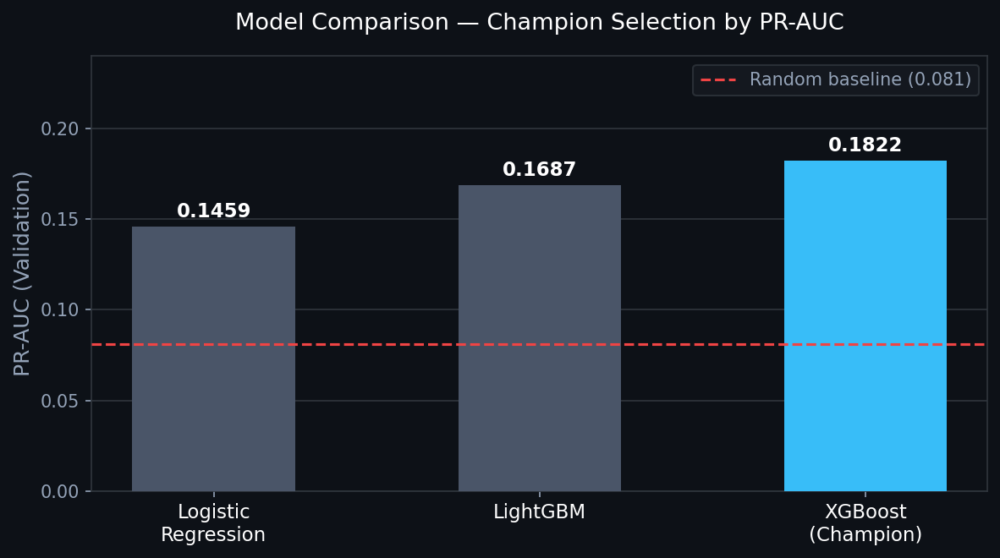
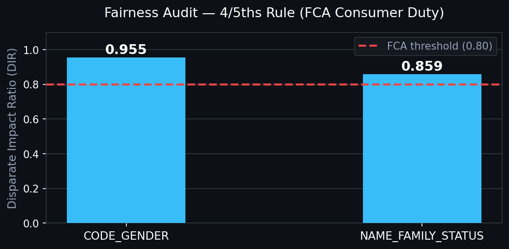
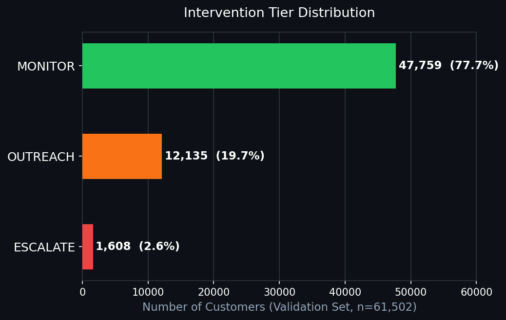

# FinWatch: Consumer Financial Vulnerability Early Warning System

[](https://www.python.org/)
[](https://xgboost.readthedocs.io/)
[](https://fastapi.tiangolo.com/)
[](https://www.fca.org.uk/firms/consumer-duty)
[](https://github.com/ouyale/Finwatch/actions)
[](tests/)
[](LICENSE)

Traditional credit models answer one question: will this new applicant default? FinWatch answers a different one - which of our **existing** customers is silently struggling right now, and what should we do about it?

The **FCA Consumer Duty (July 2023)** creates a legal obligation for banks to proactively identify customers in vulnerable circumstances - not wait for them to miss a payment. FinWatch is a full production ML system that continuously scores existing customers for financial vulnerability and routes them to tiered interventions before they reach crisis point.

---

## Table of Contents

- [The Problem](#the-problem)
- [System Architecture](#system-architecture)
- [Data](#data)
- [Exploratory Data Analysis](#exploratory-data-analysis)
- [Preprocessing](#preprocessing)
- [Feature Engineering](#feature-engineering)
- [Modelling](#modelling)
- [Fairness and Compliance](#fairness-and-compliance)
- [Intervention Tiers](#intervention-tiers)
- [Serving Layer](#serving-layer)
- [Monitoring](#monitoring)
- [Results](#results)
- [Project Structure](#project-structure)
- [Quick Start](#quick-start)
- [Tech Stack](#tech-stack)

---

## The Problem

Credit risk modelling has a blind spot. It focuses entirely on the application stage - once a loan is approved, most banks know very little about how a customer's financial position evolves over time. By the time distress signals appear in payment data, it is often too late to intervene meaningfully.

A few things make this problem genuinely hard:

- **Vulnerability is gradual.** A customer comfortably managing a mortgage at 2% may be severely stretched at 5.5%. The shift happens across months, not overnight.
- **Macro shocks matter.** Energy price spikes, inflation, and base rate rises hit different customer segments differently. A model trained on pre-2022 data has never seen conditions like 2022-2024.
- **Class imbalance is severe.** Vulnerable customers are a minority. Standard accuracy metrics will flatter a model that simply labels everyone as fine.
- **Fairness is a legal requirement.** The FCA expects banks to demonstrate that automated systems do not treat protected groups disproportionately.

FinWatch addresses all four of these.

---

## System Architecture

```
DATA SOURCES
  Home Credit Bureau Data  +  ONS API (Live Macro Indicators)
              |
              v
      TRAINING PIPELINE
  CustomerPreprocessor  ->  Feature Engineering
          |
  SMOTE (train fold only)  ->  3 Model Candidates
          |                    LR baseline, LightGBM, XGBoost
  Optuna HPO (50 trials)
          |
  Champion Selection (PR-AUC)  ->  Fairness Gate (DIR >= 0.80)
          |
  MLflow Registry  ->  Threshold Calibration
              |
              v
        SERVING LAYER
  FastAPI /score/single  ->  InterventionEngine
          /score/batch       (ESCALATE / OUTREACH / MONITOR)
          /health            + SHAP explanations
              |
     ---------+---------
     |                 |
  MONITORING       DASHBOARD
  PSI Drift        Portfolio overview
  Macro Drift      Score lookup
  Fairness Log     Drift monitor
  -> Retrain flag  Fairness audit log
```

---

## Data

I used the [Home Credit Default Risk](https://www.kaggle.com/competitions/home-credit-default-risk) dataset as the core customer feature set. It contains 307,511 loan applications with 122 features covering income, credit amounts, employment history, external credit scores, and demographic attributes.

The target variable is binary: 1 = client with payment difficulties, 0 = performing client. The class imbalance is **11.4:1** - only 8.1% of customers are vulnerable. This shaped every modelling decision downstream.

On top of the Home Credit features, I append five live macroeconomic indicators from the **ONS API** at scoring time:

| Indicator | Why it matters |
|-----------|----------------|
| Bank of England base rate | Directly affects variable mortgage and loan repayment costs |
| CPI inflation | Erodes real disposable income |
| Unemployment rate | Signals labour market stress |
| Household energy expenditure | A major fixed cost that squeezes budgets during energy shocks |
| GfK consumer confidence | Forward-looking sentiment indicator |

These are appended as constant columns to every row - every customer is scored against the same current macroeconomic environment. The baseline values at training time are saved and drift detection flags if any indicator moves more than 1.5 standard deviations from that baseline.

---

## Exploratory Data Analysis

Before writing a single line of preprocessing code, I ran a full EDA in `notebooks/01_EDA.ipynb`. Key findings that shaped the rest of the project:

**Class imbalance: 11.4:1.** Only 8.1% of customers are vulnerable. A model predicting "not vulnerable" for everyone would be 91.9% accurate and completely useless. This is why I chose PR-AUC as the evaluation metric rather than accuracy or ROC-AUC.

**Missing data is informative (MNAR).** The three external credit bureau scores (EXT_SOURCE_1/2/3) are 56%, 20%, and 0.2% missing respectively. The vulnerability rate for customers with EXT_SOURCE_1 missing is significantly higher than for customers where it is present. The absence is a signal - the customer has a thin or no credit file. Imputing with median would erase that signal. Instead, I create a binary flag (`has_ext_source_n`) and fill the missing value with a sentinel -1.

**Median over mean.** AMT_INCOME_TOTAL has skewness of 392 - a small number of very high earners pull the mean far above what is representative for most customers. All numeric imputation uses the training median.

**33 binary columns must not be scaled.** StandardScaler would convert FLAG_EMP_PHONE=1 to 3.0, which is meaningless. The EDA confirmed 33 binary columns in the raw data. I exclude all of them from scaling.

**Property columns are structural, not random.** Columns like COMMONAREA_AVG are 70%+ missing because renters do not have property data. NAME_HOUSING_TYPE already captures this with six categories each having distinct vulnerability rates - adding a binary IS_RENTER column would lose that nuance.

---

## Preprocessing

The `CustomerPreprocessor` class in `finwatch/preprocessor.py` handles all data cleaning. It is implemented as a fitted sklearn transformer - it learns statistics from training data during `.fit()`, saves them, and applies those exact saved values at scoring time via `.transform()`. This prevents leakage from inference data into the preprocessing statistics.

Steps in order (reordering would introduce bugs):

1. **Deduplicate on SK_ID_CURR** - must run before ID is dropped. Production data from multiple source systems can silently produce duplicate customer records.
2. **Drop protected and leakage columns** - SK_ID_CURR, REGION.
3. **Fix impossible values** - DAYS_BIRTH outside 18-100 years, DAYS_EMPLOYED=365243 sentinel for unemployed (flagged and NaN'd), negative income.
4. **Encode categoricals** - ordinal encoding with -1 for unknown categories seen at inference time.
5. **Handle missing values** - EXT_SOURCE: flag + sentinel -1. OWN_CAR_AGE: 0 for non-car-owners, car-owner median for car-owners with missing age. All other numerics: training median.
6. **Scale numerics** - StandardScaler excluding all binary columns.
7. **Align schema** - add missing columns as 0, reorder to training schema. Ensures consistent feature order at inference time.

---

## Feature Engineering

Raw columns often carry less signal than their relationships. `finwatch/features.py` creates derived features across three categories:

**Financial stress ratios** capture the relationship between credit obligation and financial capacity - the primary signals for vulnerability:
- `credit_to_income_ratio` - how many years of gross income is the total debt?
- `annuity_to_income_ratio` - what fraction of income goes to repayments each year?
- `credit_to_goods_ratio` - how much of the credit exceeds the goods value? A large gap suggests cash extraction.
- `ext_source_mean / min / std` - aggregate of the three credit bureau scores, treating -1 sentinel as missing.

**Employment stability:**
- `days_employed_pct_of_age` - what proportion of your life have you been employed? A 50-year-old with 2 years of employment tells a different story than a 25-year-old in the same position.

**Credit bureau enquiry counts** across six time windows (hour, day, week, month, quarter, year) - multiple recent enquiries signal financial stress and rejected applications elsewhere.

---

## Modelling

### Why gradient boosting

On tabular datasets without spatial or sequential structure, gradient boosting consistently outperforms neural networks (Grinsztajn et al., 2022). The reason is that tabular data is heterogeneous - features have different scales, distributions, and relationships that tree ensembles handle naturally. Neural networks require extensive feature engineering and regularisation to match gradient boosting on this kind of data. Tree-based models also produce SHAP explanations natively - non-negotiable for a regulated deployment where every decision needs to be explainable to a compliance team and to the customer.

I trained three candidates - Logistic Regression as a baseline, LightGBM, and XGBoost - to let the data pick the winner rather than assuming upfront.

### Handling class imbalance

I used SMOTE (Synthetic Minority Over-sampling Technique) applied to the **training fold only**. SMOTE generates synthetic minority examples by interpolating between existing ones in feature space. Applying it before the train/validation split would let synthetic data contaminate validation metrics - the reported PR-AUC would be measuring performance on artificial data, not real customers.

### Hyperparameter optimisation

Optuna with TPE (Tree-structured Parzen Estimator) Bayesian optimisation for 50 trials on both LightGBM and XGBoost. TPE builds a probabilistic model of which hyperparameter regions produce good results and focuses search there - far more efficient than grid or random search.

### Champion selection

All three candidates are evaluated on PR-AUC on the held-out validation set. PR-AUC cannot be fooled by class imbalance the way ROC-AUC can - it focuses entirely on how well the model identifies the vulnerable minority.



### Threshold calibration

I sweep every threshold from 0.01 to 0.99 and compute:

```
cost = (false_negatives * 5) + (false_positives * 1)
```

The 5:1 asymmetry reflects the regulatory reality - missing a vulnerable customer is substantially more harmful than flagging someone who turns out to be fine. The threshold minimising this cost becomes the ESCALATE boundary. The OUTREACH boundary uses a 2:1 cost ratio.

---

## Fairness and Compliance

Before any model is registered to MLflow, it must pass the **FCA 4/5ths disparate impact test**. This is a hard gate - a failing model raises a `ValueError` and is never saved or deployed regardless of its accuracy metrics.

The Disparate Impact Ratio (DIR) is computed for each protected characteristic:

```
DIR = ESCALATE rate of least-advantaged group / ESCALATE rate of most-advantaged group
```

Threshold: DIR >= 0.80. Only legally protected characteristics under the UK Equality Act 2010 are used as hard gate columns. XNA rows (4 records with no gender recorded) are excluded from the gender calculation as a data quality artefact, not a real demographic group.



This system also satisfies **UK GDPR Article 22** via SHAP values - every individual scoring decision is accompanied by the top contributing features and their direction of influence.

---

## Intervention Tiers

Thresholds are calibrated per model run, not hardcoded. After the last training run:

| Score | Tier | Action |
|-------|------|--------|
| >= 0.10 | ESCALATE | Immediate outreach - assign to specialist vulnerability team |
| 0.06 - 0.10 | OUTREACH | Proactive contact - offer support products, payment holidays |
| < 0.06 | MONITOR | Continue standard monitoring |



---

## Serving Layer

The model is served via FastAPI in `api/main.py`. Three endpoints:

- `POST /score/single` - score one customer, returns tier, score, and top SHAP features
- `POST /score/batch` - score a list of customers
- `GET /health` - API status and current model version

Request validation is handled by Pydantic v2 schemas. Invalid inputs are rejected before reaching the model. Swagger docs auto-generated at `/docs`.

---

## Monitoring

`monitoring/psi_monitor.py` implements Population Stability Index drift detection:

| PSI | Interpretation | Action |
|-----|----------------|--------|
| < 0.10 | No significant change | None |
| 0.10 - 0.20 | Moderate shift | Monitor |
| > 0.20 | Significant shift | Review and retrain |

Three retraining triggers:
1. **Scheduled** - monthly baseline retrain
2. **Feature drift** - PSI > 0.20 on any key feature
3. **Macro drift** - any ONS indicator moves more than 1.5 standard deviations from training baseline

---

## Results

| Metric | Value |
|--------|-------|
| Champion model | XGBoost |
| Test PR-AUC | **0.1877** |
| Test ROC-AUC | **0.6850** |
| Random baseline PR-AUC | 0.081 |
| Lift over baseline | 2.3x |
| Gender DIR (PASSED) | 0.955 |
| Family Status DIR (PASSED) | 0.859 |
| Test suite | 44 tests, 82% coverage |
| Customers scored (validation) | 61,502 |
| ESCALATE | 1,608 (2.6%) |
| OUTREACH | 12,135 (19.7%) |
| MONITOR | 47,759 (77.6%) |

A PR-AUC of 0.1877 on an 11.4:1 imbalanced problem is 2.3x better than random. No single feature has a correlation above 0.20 with the target - the model works by combining hundreds of weak signals through gradient boosting, not by finding one strong predictor.

---

## Project Structure

```
FinWatch/
|- finwatch/                   # Core Python package
|  |- constants.py             # Single source of truth for thresholds and config
|  |- preprocessor.py          # CustomerPreprocessor - sklearn-compatible transformer
|  |- features.py              # Feature engineering - ratios, flags, enquiry counts
|  |- macro_data.py            # ONS API client - live UK economic indicators
|  |- models.py                # Training + Optuna HPO for LightGBM and XGBoost
|  |- decision_engine.py       # InterventionEngine - score to tier conversion
|  |- fairness.py              # Disparate impact audit - FCA 4/5ths gate
|  |- explainability.py        # SHAP TreeExplainer wrapper
|
|- training/train.py           # End-to-end CLI training pipeline
|- api/main.py                 # FastAPI serving layer
|- api/schemas.py              # Pydantic request/response models
|- monitoring/psi_monitor.py   # PSI drift detection
|- dashboard/app.py            # Streamlit dashboard
|- tests/                      # pytest suite (44 tests, 82% coverage gate)
|- notebooks/01_EDA.ipynb      # Full exploratory data analysis
|- docker-compose.yml          # API + MLflow + Dashboard in containers
```

---

## Quick Start

```bash
git clone https://github.com/ouyale/Finwatch.git
cd Finwatch
pip install -e .
pip install -r requirements.txt
```

Download `application_train.csv` from [Home Credit Default Risk](https://www.kaggle.com/competitions/home-credit-default-risk/data) and place in `data/raw/`, then:

```bash
python training/train.py --data-path data/raw/application_train.csv --experiment finwatch-v1 --n-trials 50
docker-compose up --build
```

| Service | URL |
|---------|-----|
| API | http://localhost:8000 |
| Docs | http://localhost:8000/docs |
| MLflow | http://localhost:5000 |
| Dashboard | http://localhost:8501 |

---

## Tech Stack

| Component | Technology |
|-----------|-----------|
| Core ML | LightGBM + XGBoost |
| HPO | Optuna (TPE Bayesian search) |
| Imbalance | SMOTE (train fold only) |
| Fairness | 4/5ths rule (DIR >= 0.80) |
| Explainability | SHAP TreeExplainer |
| Drift detection | Population Stability Index |
| Experiment tracking | MLflow |
| API | FastAPI + Pydantic v2 |
| Dashboard | Streamlit + Plotly |
| Containerisation | Docker + docker-compose |
| CI/CD | GitHub Actions |
| Macro features | ONS API |

---

## Regulatory Context

| Regulation | Relevance |
|-----------|-----------|
| FCA Consumer Duty (2023) | Proactive identification of vulnerable customers |
| FCA PS21/11 | Fair treatment of vulnerable customers |
| UK GDPR Article 22 | Right to explanation for automated decisions |
| PRA SS1/23 | Model validation, monitoring, and challenger processes |

---

**Barbara Werobaobayi** | ML Engineer
